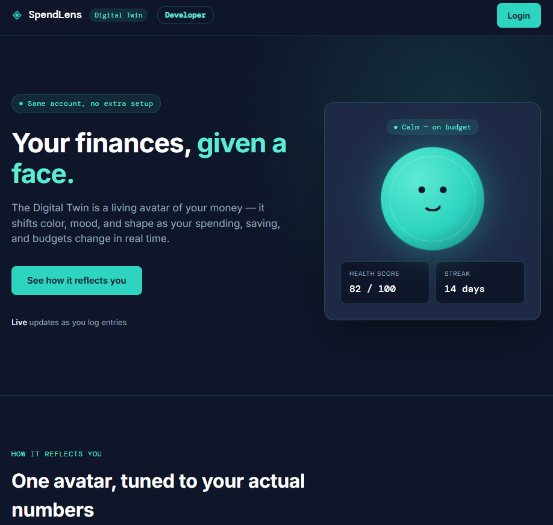

<div align="center">

# 🚀 DevSecOps Expense Tracker & Digital Twin Platform(SpensLens)

### End-to-End Production-Ready DevSecOps Pipeline with CI/CD, GitOps, Kubernetes & Security Automation

<p align="center">


</p>

---

### 💡 A Complete DevSecOps Project demonstrating Secure CI/CD, GitOps, Kubernetes Deployment, Monitoring & Continuous Delivery.

</div>

---

# 📖 Table of Contents

- Project Overview
- Architecture
- Technology Stack
- Features
- Project Structure
- CI/CD Pipeline
- Security
- Kubernetes Deployment
- Monitoring
- Screenshots
- Getting Started
- Future Enhancements
- Author

---

# 📌 Project Overview

This project demonstrates a **production-grade DevSecOps implementation** for deploying a **Flask-based Expense Tracker and Digital Twin Platform** using modern DevOps practices.

The application is automatically built, tested, scanned, containerized, deployed, and monitored using a complete CI/CD pipeline integrated with GitOps.

The project focuses on:

- ✅ DevSecOps
- ✅ CI/CD Automation
- ✅ Kubernetes
- ✅ GitOps
- ✅ Security Scanning
- ✅ Monitoring & Alerting
- ✅ Cloud Deployment

---

# 🏗️ System Architecture

```text
                    👨‍💻 Developer
                          │
                          ▼
                     GitHub Repository
                          │
                          ▼
                  Jenkins CI Pipeline
                          │
        ┌─────────────────|
        ▼                 ▼                 
   SonarQube         Trivy Scan     
        │                 │
        └───────────┬─────┘
                    ▼
             Docker Image Build
                    │
                    ▼
             Docker Hub Registry
                    │
                    ▼
      Update Kubernetes Manifest
                    │
                    ▼
                GitHub (GitOps)
                    │
                    ▼
                 Argo CD Sync
                    │
                    ▼
          Kubernetes Cluster (EC2)
                    │
         ┌──────────┴──────────┐
         ▼                     ▼
 Expense Tracker        Digital Twin
         │                     │
         └──────────┬──────────┘
                    ▼
              Prometheus
                    │
                    ▼
                Grafana
```

---

# ⚙️ Technology Stack

| Category | Technologies |
|----------|--------------|
| Frontend | HTML, CSS, JavaScript |
| Backend | Python, Flask |
| Database | MySQL |
| Containerization | Docker, Docker Hub |
| CI/CD | Jenkins, GitHub |
| Security | SonarQube, Trivy |
| GitOps | Argo CD |
| Orchestration | Kubernetes |
| Monitoring | Prometheus, Grafana |
| Cloud | AWS EC2 |

---

# ✨ Features

## 🔐 Authentication

- User Login
- Secure Authentication

## 💰 Expense Tracker

- Add Expenses
- Edit Expenses
- Delete Expenses
- Expense Dashboard

## 🌐 Digital Twin Dashboard

- Interactive Dashboard
- Real-Time Visualization

## 🐳 Containerization

- Dockerized Flask Application
- Docker Hub Integration

## ☸ Kubernetes

- Deployment
- Services
- ConfigMaps
- Secrets
- Namespace
- Ingress
- Horizontal Pod Autoscaler
- Rolling Updates

## 🚀 DevSecOps Pipeline

- Jenkins Automation
- SonarQube Code Analysis
- Trivy Vulnerability Scanning
- Docker Build
- Docker Push
- GitOps Deployment
- Argo CD Continuous Delivery

## 📊 Monitoring

- Prometheus Metrics
- Grafana Dashboards
- Kubernetes Metrics
- Application Monitoring
- Alert Rules

---

# 📂 Project Structure

```bash
Devsecops-Project
│
├── Expense Tracker/
│
├── digital-twin/
│
├── kubernetes/
│   ├── expense-tracker/
│   ├── digital-twin/
│   ├── mysql/
│   ├── ingress/
│   ├── hpa/
│   ├── configmap.yaml
│   ├── secret.yaml
│   └── namespace.yaml
│
├── Dockerfile
├── Jenkinsfile
├── requirements.txt
└── README.md
```

---

# 🔄 CI/CD Workflow

```text
Code Push
    │
    ▼
GitHub Repository
    │
    ▼
Jenkins Pipeline
    │
    ├── Checkout Code
    ├── SonarQube Analysis
    ├── Trivy Security Scan
    ├── Build Docker Image
    ├── Push Docker Image
    ├── Update Kubernetes YAML
    └── Push Manifest Changes
            │
            ▼
        Argo CD Sync
            │
            ▼
      Kubernetes Cluster
            │
            ▼
      Rolling Deployment
            │
            ▼
 Application Available
```

---

# 🔒 DevSecOps Security

✔ SonarQube Static Code Analysis

✔ Trivy Image Vulnerability Scan

✔ Secure Kubernetes Secrets

✔ Container Image Scanning

✔ Secure GitOps Deployment

---

# ☸ Kubernetes Components

- Namespace
- Deployment
- Service
- ConfigMap
- Secret
- Ingress
- HPA
- Rolling Updates

---

# 📊 Monitoring Stack

### Prometheus

- Application Metrics
- Kubernetes Metrics
- Node Metrics
- Alert Rules

### Grafana

- Infrastructure Dashboard
- Kubernetes Dashboard
- Application Dashboard
- Resource Utilization

---

# ☁ Deployment Environment

| Component | Platform |
|-----------|----------|
| Cloud | AWS EC2 |
| Containers | Docker |
| Registry | Docker Hub |
| Kubernetes | Self Managed Cluster |
| GitOps | Argo CD |
| Monitoring | Prometheus & Grafana |

---
# 📸 Screenshots

## 🔐 Expense Tracker


---

## 🌐 Digital Twin Dashboard



---

## 🏗️ Project Architecture


---

## 🚀 Jenkins Pipeline Flow


---

## 📋 Jenkins Pipeline Stages


---

## 🔍 SonarQube Report


---

## ☸ Kubernetes Deployment


---

# 📈 Future Enhancements

- Slack Notifications
- Microsoft Teams Integration
- Email Alerts
- AWS EKS Deployment
- Terraform Infrastructure Automation
- Helm Charts
- Automated Backup
- Blue-Green Deployment
- Canary Deployment
- HashiCorp Vault Integration

---

# 🌟 Key Highlights

- ✅ End-to-End DevSecOps Pipeline
- ✅ Secure CI/CD Automation
- ✅ GitOps Deployment using Argo CD
- ✅ Kubernetes Production Deployment
- ✅ Security Scanning with SonarQube & Trivy
- ✅ Dockerized Flask Application
- ✅ Monitoring with Prometheus & Grafana
- ✅ AWS Cloud Deployment

---

# 🤝 Contributing

Contributions are welcome!

1. Fork the repository
2. Create a new branch
3. Commit your changes
4. Push your branch
5. Open a Pull Request

---

# ⭐ Support

If you found this project useful, please consider giving it a ⭐ on GitHub!

---

<div align="center">

# 👨‍💻 Author

## Hemanth Kumar Rao M

### DevOps | Cloud | Kubernetes | DevSecOps Engineer

⭐ Don't forget to Star this repository if you found it useful!

</div>
